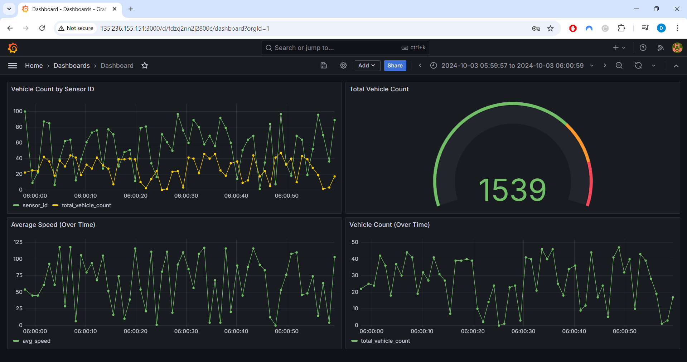
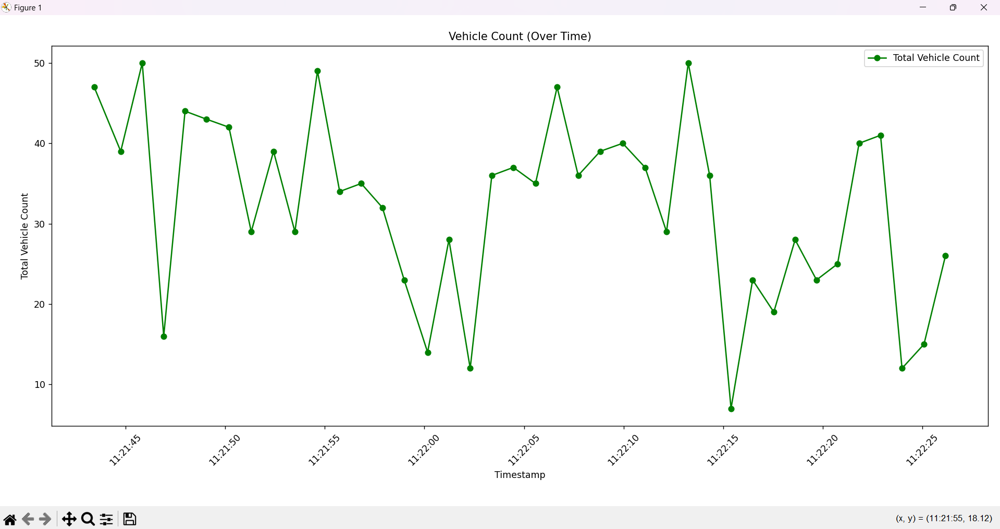
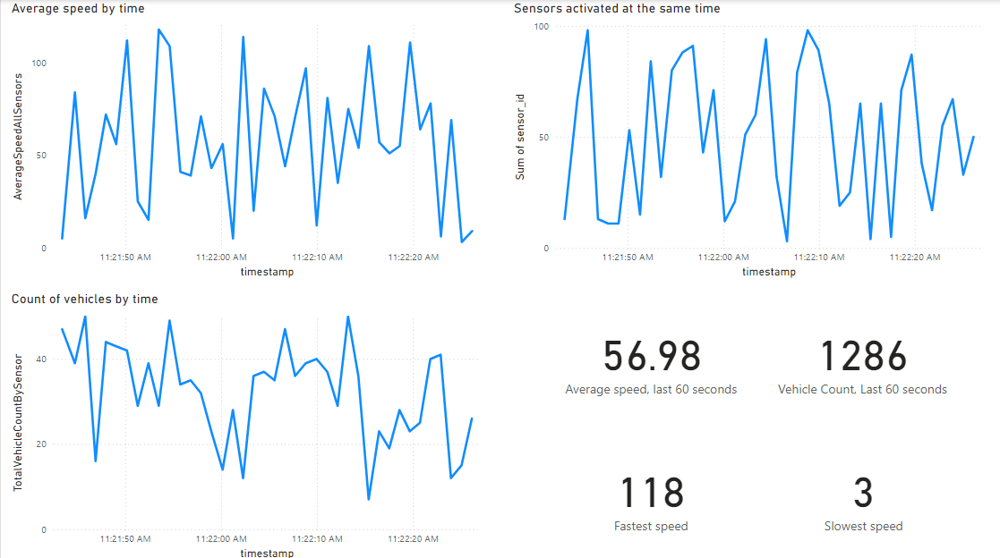

## Requirements

This project requires several Python packages to function correctly. The dependencies are listed in the `requirements.txt` file. You can install them using pip.

### Installation

To install the required packages, run the following command:

```bash
pip install -r requirements.txt
```

### Dependencies
The following packages are included in the `requirements.txt`:

- **azure-storage-queue**: This package is used to interact with Azure Storage Queues.
- **pyodbc**: This package is used for connecting to SQL Server databases.
- **matplotlib**: A plotting library for creating static, animated, and interactive visualizations in Python.
- **pandas**: A data manipulation and analysis library that provides data structures and functions needed to work with structured data.
- **datetime**: A built-in Python module for manipulating dates and times.

Make sure you have Python 3.x installed on your system before installing the dependencies.

## Data Producer

The `dataproducer.py` script is responsible for generating and sending simulated sensor data to an Azure Storage Queue. Below is a breakdown of its functionality:

### Features
- **Data Generation**: The script generates random sensor data, including:
  - A timestamp in ISO 8601 format.
  - A random sensor ID between 1 and 100.
  - A random vehicle count between 0 and 50.
  - A random average speed between 0 and 120 km/h.
  
- **Queue Communication**: The generated data is sent to an Azure Storage Queue using the Azure SDK for Python.

### Requirements
- Python 3.x
- Azure Storage Queue SDK for Python
- Required environment variables:
  - `azure_storage_account_name`
  - `azure_storage_account_key`
  - `azure_storage_queue_name`
  - `sql_server`
  - `sql_database`
  - `sql_user`
  - `sql_password`

### Usage
To run the `dataproducer.py` script, ensure that the required environment variables are set, and execute the script:

```bash
python dataproducer.py
```

The script will continuously generate and send data to the specified Azure Storage Queue every second until interrupted.

### Logging
The script logs its operations, including successful message sends and any errors encountered during execution. The logging level is set to `INFO` by default.

### Example Output
When the script is running, you can expect log entries similar to the following:

```
2023-10-01 12:00:00 - INFO - Connected to Storage account: your_account_name
2023-10-01 12:00:01 - INFO - Message sent successfully. Message ID: your_message_id
2023-10-01 12:00:01 - INFO - Sent message: {"timestamp": "2023-10-01T12:00:01.123Z", "sensor_id": 45, "vehicle_count": 10, "average_speed": 55.3}
```

## Consumer Script

The `consumerscript.py` script is designed to process messages from an Azure Storage Queue and store the data into a SQL Server database. Below is a breakdown of its functionality:

### Features
- **Queue Communication**: The script connects to an Azure Storage Queue to receive messages containing sensor data.
- **Data Processing**: Each message is deserialized, and the data is extracted for insertion into a SQL Server database.
- **Database Interaction**: The script uses `pyodbc` to connect to the SQL Server and execute insert queries.

### Requirements
- Python 3.x
- Azure Storage Queue SDK for Python
- PyODBC for SQL Server connectivity
- Required environment variables:
  - `azure_storage_account_name`
  - `azure_storage_account_key`
  - `azure_storage_queue_name`
  - `sql_server`
  - `sql_database`
  - `sql_user`
  - `sql_password`

### Usage
To run the `consumerscript.py` script, ensure that the required environment variables are set, and execute the script:

```bash
python consumerscript.py
```

The script will continuously check the Azure Storage Queue for new messages and process them until the queue is empty for a specified number of attempts.

### Logging and Output
The script prints the status of the connection, the approximate message count in the queue, and the results of message processing. It also handles errors during message processing and provides feedback on the number of messages processed.


## Data Visualization Script

The `testmatplotlib.py` script is designed to fetch sensor data from a SQL Server database and visualize it using Matplotlib. Below is a breakdown of its functionality:

### Features
- **Database Connection**: The script connects to a SQL Server database using `pyodbc`.
- **Data Fetching**: It retrieves sensor data, including sensor ID, vehicle count, average speed, and timestamp from the `SensorData` table.
- **Data Visualization**: The script generates a line chart to visualize the total vehicle count over time.

### Requirements
- Python 3.x
- Required packages:
  - `pyodbc`
  - `matplotlib`
  - `pandas`

### Usage
To run the `testmatplotlib.py` script, ensure that the required environment variables are set, and execute the script:

```bash
python testmatplotlib.py
```

### Example Output
When the script is executed, it will display a line chart similar to the following:

- **Title**: Vehicle Count (Over Time)
- **X-axis**: Timestamps
- **Y-axis**: Total Vehicle Count

The chart will show the total vehicle count aggregated by timestamp, providing a visual representation of the data over time.

### Note
Make sure that the SQL Server database is accessible and contains the `SensorData` table with the appropriate schema for the script to function correctly.


## Power BI Dashboard

The `finaldashboardcloudproject.pbix` file is a Power BI project that visualizes the sensor data collected from the Azure Storage Queue and stored in the SQL Server database. Below is a breakdown of its functionality:

### Features
- **Data Visualization**: The dashboard provides interactive visualizations of the sensor data, allowing users to analyze trends and patterns over time.
- **Data Sources**: The dashboard connects to the SQL Server database to fetch the relevant sensor data for visualization.
- **User Interaction**: Users can filter and drill down into the data to gain insights into vehicle counts, average speeds, and other metrics.

### Requirements
- Power BI Desktop: Ensure you have Power BI Desktop installed to open and interact with the `.pbix` file.

### Usage
To use the Power BI dashboard, follow these steps:

1. Open Power BI Desktop.
2. Load the `finaldashboardcloudproject.pbix` file.
3. Ensure that the SQL Server database is accessible and contains the `SensorData` table with the appropriate schema.
4. Interact with the dashboard to explore the visualizations.

### Note
Make sure to configure the data source settings in Power BI to connect to your SQL Server database. You may need to provide the server name, database name, and authentication details to access the data.


## Visualizations

This project includes various visualizations to represent the sensor data effectively. Below are examples of the visualizations generated using different tools.

### Grafana Dashboard


The Grafana dashboard provides real-time insights into vehicle counts and average speeds. Key features include:
- **Vehicle Count by Sensor ID**: Displays the vehicle count for each sensor over time.
- **Total Vehicle Count**: A gauge showing the total number of vehicles detected.
- **Average Speed**: A line chart representing the average speed of vehicles over time.
- **Vehicle Count Over Time**: A line chart showing the total vehicle count aggregated by timestamp.

### Matplotlib Visualization


The Matplotlib script generates a line chart to visualize the total vehicle count over time. Key features include:
- **Total Vehicle Count**: A line chart that aggregates vehicle counts by timestamp, providing a clear view of trends over time.

### Power BI Dashboard


The Power BI dashboard visualizes the sensor data collected from the Azure Storage Queue and stored in the SQL Server database. Key features include:
- **Average Speed by Time**: A line chart showing the average speed of vehicles over time.
- **Count of Vehicles by Time**: A line chart displaying the total vehicle count over time.
- **Real-time Metrics**: Displays key metrics such as average speed and vehicle count for the last 60 seconds.

These visualizations help in analyzing trends and patterns in the sensor data, providing valuable insights for decision-making.


## Cost Estimates

The `cost estimate azure sql db and vm ubuntu.xlsx` file provides a detailed breakdown of the estimated costs associated with using Azure services for this project. This includes costs for:

### Azure SQL Database
- **Service Type**: Azure SQL Database
- **Region**: North Europe
- **Description**: 
  - Elastic Pool, vCore, Hyperscale, Standard-series (Gen 5)
  - Locally Redundant, 1 - 24 vCore Pool(s) for 730 hours
  - 0 high availability replicas per database for 730 hours
  - 10 TB Storage, RA-GRS Backup Storage Redundancy
  - 0 GB Point-In-Time Restore
- **Estimated Monthly Cost**: $6,965.03

### Virtual Machines
- **Service Type**: Virtual Machines
- **Region**: North Europe
- **Description**: 
  - 1 B16pls v2 (16 vCPUs, 32 GB RAM) for 730 hours (Pay as you go)
  - Linux, 1 managed disk – E40; Inter Region transfer type, 5 GB outbound data transfer from North Europe to East Asia
- **Estimated Monthly Cost**: $533.93

### Total Estimated Cost
- **Total Estimated Monthly Cost**: $7,498.96

### Usage
To view the cost estimates:

1. Open the `cost estimate azure sql db and vm ubuntu.xlsx` file using Microsoft Excel or any compatible spreadsheet application.
2. Review the detailed cost breakdowns and assumptions used in the calculations.

### Note
These estimates are subject to change based on actual usage and Azure pricing updates. It is recommended to regularly check the Azure Pricing Calculator for the most accurate and up-to-date pricing information.


